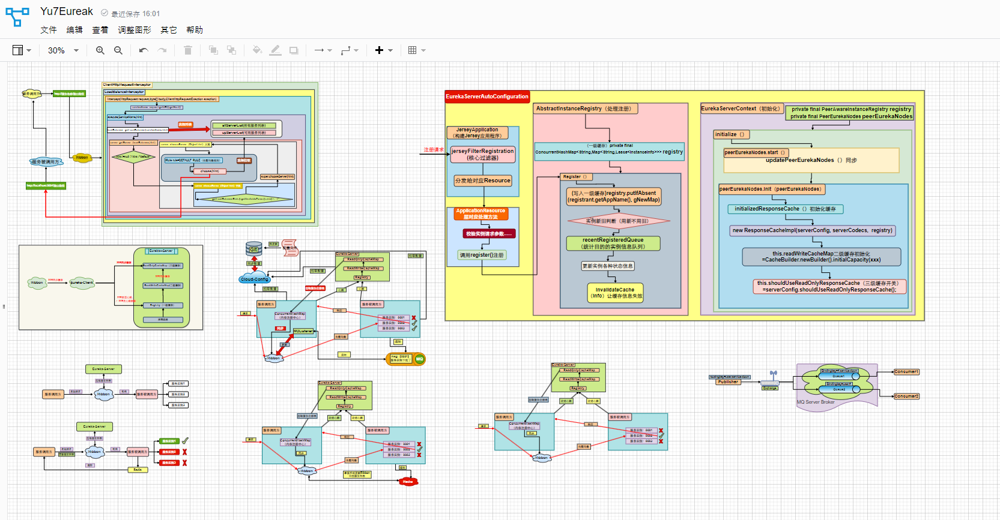
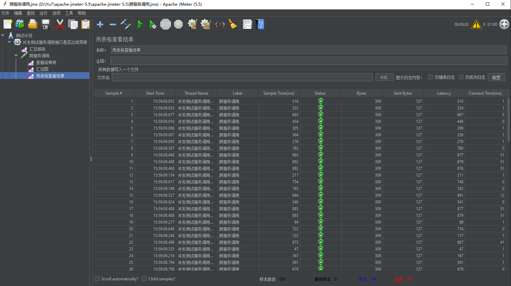

## 这是Eureka+Ribbon架构中服务下线延迟感知的系列解决方案，从入门到精通。涵盖内容十分丰富，并配套相关文档：
### 1.SpringCloud集成Eureka实现负载均衡:
http://t.csdnimg.cn/ErOpH --(开端)

### 2.Eureka基于Ribbon负载均衡的调用链路流程分析：
http://t.csdnimg.cn/NPcMU --(远程调用负载均衡源码)

### 3.通过JMeter压测结果来分析Eureka多种服务下线机制后的服务感知情况：
http://t.csdnimg.cn/pkI84 --(压测)

### 4.通过Redis手动更新Ribbon缓存来解决Eureka微服务架构中服务下线感知的问题：
http://t.csdnimg.cn/Ef0N0 --(方案一：Redis+AOP)

### 5.从实际业务问题出发去分析Eureka-Server端源码：
http://t.csdnimg.cn/Q2NQX --(Eureka-Server源码)

### 6.这一次终于使用MQ解决了Eureka服务下线延迟感知问题：
http://t.csdnimg.cn/bY7Oc --(方案二：RabbitMq)

### 7.SpringCloudConfig+SpringCloudBus+Actuator+Git实现Eureka关键配置属性热更新(全程不重启服务)：
http://t.csdnimg.cn/jOfPY --(优化)

## 各种通俗易懂的源码流程图、调用流程图：

## 全面方位的压测数据为结果做支撑(每一个方案和改动都会有JMeter对其进行压测,在文章中都有具体体现)

